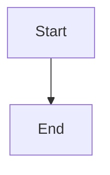

# Barun Debnath's Portfolio

🚀 SRE | Systems Engineer | Platform Engineer

## About Me

Exploring the world of **SRE**, **Systems**, and **Platform Engineering**, one system crash (oops, _incident_) at a time. When I'm not debugging or building, you'll find me buried in mangas, sipping coffee, and obsessing over _that one perfect setup_.

## Professional Journey

| Designation | Organization                        | Duration         |
| ----------- | ----------------------------------- | ---------------- |
| SRE         | [One2N](https://one2n.io/)          | Jun'24 - Present |
| SRE         | [Media.Net](https://www.media.net/) | Jul'23 - Jun'24  |
| SRE Intern  | [Media.Net](https://www.media.net/) | Jan'23 - Jun'23  |

From firefighting production issues to building scalable platforms, the journey's been a wild ride!

📄 Check out my detailed experience in my [RESUME](https://drive.google.com/file/d/1kEe29ZLiOqxdEV0eDXisdqvwei3Fn4zh/view?usp=sharing)

## Let's Connect!

Whether it's about DevOps musings, system design discussions, or just sharing memes - I'm always up for a good conversation! You can find me at:

- Portfolio: [barundebnath.com](https://barundebnath.com)
- Twitter: [@heydensetsu](https://twitter.com/heydensetsu)
- LinkedIn: [Barun Debnath](https://www.linkedin.com/in/barundebnath)
- Medium: [Barun Debnath](https://barundebnath.medium.com)
- Email: barundebnath91@gmail.com

Grab a coffee, poke around, and don't forget to say hi!

## Built With

This portfolio is built using [Astro Micro](https://github.com/trevortylerlee/astro-micro) - a minimal template that comes with:

- Full type safety
- Sitemap generation
- RSS feed support
- Markdown + MDX support
- TailwindCSS styling
- System, light, and dark themes

Special thanks to [Trevor Tyler Lee](https://github.com/trevortylerlee) for creating this amazing template!

## Setup & Development

### Prerequisites

- Node.js 18+ or use devbox for environment management
- npm or your preferred package manager

### Option 1: Using devbox + direnv (Recommended)

1. Install [devbox](https://www.jetify.com/devbox/docs/installing_devbox/):

   ```bash
   curl -fsSL https://get.jetify.com/devbox | bash
   ```

2. Install [direnv](https://direnv.net/docs/installation.html):

   ```bash
   # Ubuntu/Debian
   sudo apt install direnv

   # macOS
   brew install direnv
   ```

3. Add direnv hook to your shell (add to ~/.bashrc, ~/.zshrc, etc.):

   ```bash
   eval "$(direnv hook bash)"  # for bash
   eval "$(direnv hook zsh)"   # for zsh
   ```

4. Clone the repository and navigate to the project directory:

   ```bash
   git clone <your-repo-url>
   cd portfolio
   ```

5. Allow direnv and enter the devbox environment:

   ```bash
   direnv allow
   ```

   This will automatically activate the devbox environment with Python 3.11, uv, and direnv whenever you enter the directory.

6. Install Node.js dependencies:
   ```bash
   npm install
   ```

**Alternative**: If you prefer manual devbox usage without direnv:

```bash
devbox shell  # Enter the development environment manually
```

### Option 2: Manual setup

1. Install Node.js 18+ (you can use nvm):

   ```bash
   curl -o- https://raw.githubusercontent.com/nvm-sh/nvm/v0.40.3/install.sh | bash
   source ~/.bashrc
   nvm install --lts
   nvm use --lts
   ```

2. Install dependencies:
   ```bash
   npm install
   ```

### Environment Configuration

1. Copy the environment example file:

   ```bash
   cp .env.example .env
   ```

2. Configure Cloudflare R2 settings in `.env` (optional, for media storage):
   ```
   R2_ACCESS_KEY_ID=your_r2_access_key_id
   R2_SECRET_ACCESS_KEY=your_r2_secret_access_key
   R2_ENDPOINT_URL=https://your_account_id.r2.cloudflarestorage.com
   R2_BUCKET_NAME=your_bucket_name
   R2_PUBLIC_URL=https://your_custom_domain.com
   ```

### Development

Start the development server:

```bash
npm run dev
```

The site will be available at `http://localhost:4321`

### Building

Build the project for production:

```bash
npm run build
```

Preview the production build:

```bash
npm run preview
```

### Available Scripts

- `npm run dev` - Start development server
- `npm run build` - Type check and build for production
- `npm run preview` - Preview production build
- `npm run astro` - Run Astro CLI commands

### Devbox Scripts

- `devbox run setup-hooks` - Manually setup git hooks
- `devbox run migrate-giphy` - Manually run Giphy migration script

### Git Hooks

The project includes an automatic git pre-commit hook that:

- Scans blog posts for Giphy links on every commit
- Downloads GIFs and uploads them to Cloudflare R2
- Replaces Giphy links with R2 URLs in your markdown files
- Automatically adds modified files to the commit

The hook is automatically set up when you enter the devbox environment. To bypass the hook for a specific commit:

```bash
git commit --no-verify
```

## Diagram Support

This blog supports both **Mermaid** and **D2lang** diagrams with automatic theme switching and responsive design.

### Mermaid Diagrams

Mermaid diagrams are rendered client-side and automatically adapt to your theme preference.

#### Usage

````markdown

````

#### Supported Diagram Types

- Flowcharts
- Sequence diagrams
- Gantt charts
- Class diagrams
- State diagrams
- Entity Relationship diagrams
- User Journey diagrams
- Git graphs
- Pie charts
- Requirement diagrams
- C4 diagrams
- Mindmaps
- Timeline diagrams
- And more!

#### Features

- ✅ Client-side rendering (privacy-friendly)
- ✅ Automatic theme switching
- ✅ All Mermaid diagram types supported
- ✅ Works offline after initial load
- ✅ Zero configuration needed

### D2lang Diagrams

D2 diagrams are rendered at build-time, providing optimized SVG output with advanced layout algorithms.

#### Usage

````markdown
```d2
server -> database: query
database -> server: results
```
````

#### Features

- ✅ Build-time rendering (faster page loads)
- ✅ Advanced layout algorithms
- ✅ Better for complex system diagrams
- ✅ Optimized SVG output
- ✅ CSS-based theme styling

#### Advanced Example

````markdown
```d2
title: System Architecture

users: Users {
  shape: person
  style.fill: "#e1f5fe"
}

api: API Server {
  shape: hexagon
  style.fill: "#4caf50"
}

db: Database {
  shape: cylinder
  style.fill: "#ff9800"
}

users -> api: HTTP requests
api -> db: SQL queries
db -> api: Results
api -> users: JSON response
```
````

### Theme Integration

Both diagram types automatically adapt to your site's theme:

- **Light Mode**: Clean, professional appearance with subtle colors
- **Dark Mode**: High contrast with theme-appropriate colors
- **Smooth Transitions**: Seamless switching between themes

### Performance & Privacy

- **Mermaid**: 100% client-side rendering, no external dependencies at runtime
- **D2**: Build-time processing, no runtime overhead
- **Corporate Friendly**: No external API calls, works in restricted environments
- **Offline Capable**: Both solutions work completely offline

### Example Blog Post

Check out the [Diagram Showcase](/blog/diagram-showcase) post to see both diagram types in action with various examples and theme switching demonstrations.

### Project Structure

```
src/
├── components/     # Reusable Astro components
├── content/        # MDX content (blog posts, notes, etc.)
├── layouts/        # Page layouts
├── pages/          # Route pages
├── styles/         # Global styles
└── utils/          # Utility functions
```

---
