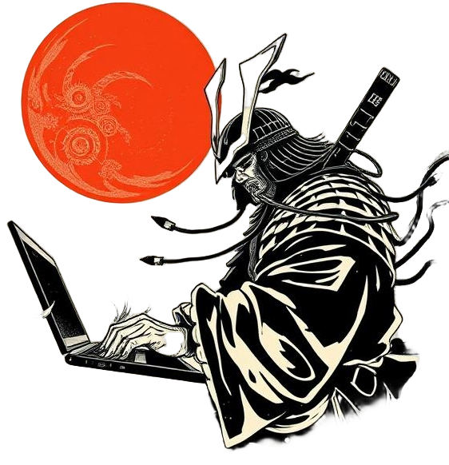

Hi, I am ***Barun Debnath*** 👋

🚀 Exploring the world of **SRE**, **Systems**, and **Platform Engineering**, one system crash (oops, *incident*) at a time. 

When I'm not debugging or building, you’ll find me buried in mangas, sipping coffee, and obsessing over *that one perfect setup*.  

---

> [!note] 💼 **What I’ve Been Up To**
> ### Here's my highlight reel so far:  
>
> | **Designation** | **Organization** | **Duration** |
> | ----------------| ---------------- | ------------ |
> | SRE | [One2N](https://one2n.io/) | Jun'24 - Present |
> | SRE | [Media.Net](https://www.media.net/) | Jul'23 - Jun'24 |
> | SRE Intern | [Media.Net](https://www.media.net/) | Jan'23 - Jun'23 |
> 
> From firefighting production issues to building scalable platforms, the journey’s been a wild ride!  
> Know more about my work experience from my **[RESUME](https://drive.google.com/file/d/1kEe29ZLiOqxdEV0eDXisdqvwei3Fn4zh/view?usp=sharing)**

---

> [!tip] ✉️ **Want to Chat?**  
> 
> ### Find me at 
> - [twitter](https://twitter.com/heydensetsu) for my random thoughts and DevOps musings. 
> - [barundebnath91@gmail.com](mailto:barundebnath91@gmail.com) for serious conversations (or memes, no judgment).  

---

### 🎯 **Why This Site Exists** 

The goal? Build a digital playground where blogs, projects, and knowledge collide.  
Think of it as my personal **command center** 🛠️ with: 

1. [[/Blogs]] - Personal reflections, tech rants, and lessons from the trenches.
2. [[/Garden]] - A curated collection of links, resources, and ideas – my digital greenhouse 🌱.  
3. [[/Projects]] - A sneak peek into what I’m tinkering with.
4. [[/Notes]] - Quick summaries of books, papers, and videos – all the wisdom without the fluff.
5. [[/Shelf]] - Research papers, books, and blogs I’ve devoured (and recommend).
6. [[/Snippets]] - My day-to-day code hacks and helpful tricks, ready at my fingertips.

---

> 💡 Curious about the inspiration behind this site?  
> Visit [[/Notes/Building-This-Blog/useful-links-inspirations]] to dive into its backstory!

---

### Ready to Explore? 🌟  
Grab a coffee, poke around, and don’t forget to say hi!
