# Diagram Showcase: Mermaid & D2lang Integration

This post demonstrates the newly integrated diagram support in the blog, featuring both **Mermaid** and **D2lang** diagrams with automatic theme switching and responsive design.

## Mermaid Diagrams

Mermaid diagrams are rendered client-side and automatically adapt to your theme preference.

### Flowchart Example

```mermaid
graph TD
    A[Start] --> B{Is it working?}
    B -->|Yes| C[Great! 🎉]
    B -->|No| D[Debug the issue]
    D --> E[Check logs]
    D --> F[Review config]
    E --> G[Fix found?]
    F --> G
    G -->|Yes| H[Apply fix]
    G -->|No| I[Ask for help]
    H --> B
    I --> J[Get assistance]
    J --> B
    C --> K[Deploy to production]
```



### Sequence Diagram


### System Architecture


## D2lang Diagrams

D2 diagrams are rendered at build-time, providing optimized SVG output with advanced layout algorithms.

### Simple System Overview

```d2
users -> web_server: HTTP requests
web_server -> database: SQL queries
web_server -> cache: Cache lookup
cache -> database: Cache miss
web_server -> cdn: Static assets
cdn -> users: Fast delivery
```

### Complex Architecture Diagram

```d2
title: Blog Architecture with Diagram Support

users: Users {
  shape: person
  style.fill: "#e1f5fe"
}

frontend: Frontend Layer {
  astro: Astro Framework {
    shape: hexagon
    style.fill: "#ff6b35"
  }

  mdx: MDX Processing {
    shape: document
    style.fill: "#4caf50"
  }

  themes: Theme System {
    shape: circle
    style.fill: "#9c27b0"
  }
}

processing: Build Processing {
  mermaid_plugin: Mermaid Integration {
    shape: cloud
    style.fill: "#2196f3"
  }

  d2_plugin: D2 Remark Plugin {
    shape: cylinder
    style.fill: "#ff9800"
  }

  d2_cli: D2 CLI {
    shape: package
    style.fill: "#795548"
  }
}

output: Generated Output {
  html: Static HTML {
    shape: page
    style.fill: "#4caf50"
  }

  svg: SVG Diagrams {
    shape: document
    style.fill: "#e91e63"
  }

  js: Client JS {
    shape: code
    style.fill: "#ffc107"
  }
}

users -> frontend.astro: Browse blog
frontend.astro -> frontend.mdx: Process content
frontend.mdx -> processing.mermaid_plugin: Mermaid blocks
frontend.mdx -> processing.d2_plugin: D2 blocks
processing.d2_plugin -> processing.d2_cli: Generate SVG
processing.mermaid_plugin -> output.js: Client rendering
processing.d2_cli -> output.svg: Build-time SVG
frontend.astro -> output.html: Static pages
frontend.themes -> output.js: Theme switching
```

### Database Schema Example

```d2
users: Users {
  shape: sql_table
  id: int {constraint: primary_key}
  email: varchar(255) {constraint: unique}
  name: varchar(100)
  created_at: timestamp
}

posts: Blog Posts {
  shape: sql_table
  id: int {constraint: primary_key}
  title: varchar(255)
  content: text
  author_id: int {constraint: foreign_key}
  published_at: timestamp
  tags: json
}

comments: Comments {
  shape: sql_table
  id: int {constraint: primary_key}
  post_id: int {constraint: foreign_key}
  author_id: int {constraint: foreign_key}
  content: text
  created_at: timestamp
}

users.id -> posts.author_id
users.id -> comments.author_id
posts.id -> comments.post_id
```

## Comparison: Mermaid vs D2

| Feature           | Mermaid                  | D2lang                        |
| ----------------- | ------------------------ | ----------------------------- |
| **Rendering**     | Client-side              | Build-time                    |
| **Performance**   | Loads with page          | Pre-rendered SVG              |
| **Themes**        | Auto-switching           | CSS-based styling             |
| **Complexity**    | Good for simple diagrams | Excellent for complex layouts |
| **Interactivity** | Limited                  | Static but precise            |
| **File Size**     | JS bundle required       | Optimized SVG only            |

## Theme Integration

Both diagram types automatically adapt to your site's theme:

- **Light Mode**: Clean, professional appearance with subtle colors
- **Dark Mode**: High contrast with theme-appropriate colors
- **Smooth Transitions**: Seamless switching between themes

Try switching between light and dark modes using the theme toggle to see the diagrams adapt!

## Usage in Your Posts

### Mermaid Syntax

````markdown

````

### D2 Syntax

````markdown
```d2
server -> database: query
database -> server: results
```
````

## Technical Implementation

The integration includes:

1. **Mermaid**: Uses `astro-mermaid` package for client-side rendering
2. **D2**: Custom remark plugin that processes D2 code blocks at build time
3. **Styling**: Responsive CSS with theme-aware colors
4. **Performance**: Optimized loading and caching strategies

Both solutions are privacy-focused with no external dependencies at runtime, making them perfect for corporate environments and offline usage.

---

_This showcase demonstrates the power of combining multiple diagram tools to create rich, interactive documentation that adapts to your readers' preferences._
